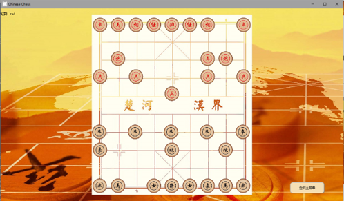
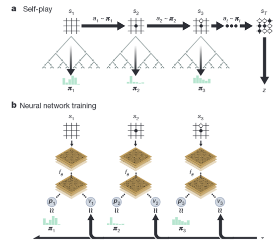

# Chinese Chess

## 环境要求
- PvC需要在tensorflow1.x模式下运行
- PvP联机模式需要在同一局域网下
- 安装环境：pip install -r requirements.txt
- 程序从main.py开始执行

## 项目介绍

要实现满足用户需求的象棋程序，需要有棋盘棋子的局面、鼠标响应来控制棋子、设计棋子走法的规则、网络对战的通信协议、异常处理、胜负判断等，具体的介绍如下：
### 1.	GUI界面显示游戏内容
在游戏中，采用Qt设计了游戏的GUI，并采用分级界面，分层次显示不同功能，使得程序运行条例清晰。在主页面可以选择进入PvP或者PvC，即玩家与玩家对战或玩家与电脑对战。在PvP的子界面还会有本地对战和联机对战的选项
<div align="center">
 <br />
</div>

### 2.	鼠标相应
进行游戏时，才用鼠标点击的方式控制棋子的移动，方便快捷。实际操作的时候，只需要点击棋子，然后点击要走的地方，便能实现相应功能，同时还会对错误的走法进行判断，错误的走法会不明显地提示用户。
### 3.	棋子局面
作为中国象棋游戏，棋子和棋盘是必不可少的。没有这两部分，就无法实现剩余的功能。不仅如此，如果只有棋子和棋盘，没有两者的结合，那么中国象棋的游戏功能是无法实现的。因此，棋子和棋盘设计在这个游戏设计中至关重要。
<div align="center">
 <br />
</div>

### 4.	棋子功能
象棋中正是由于不同棋子的不同走法产生了无数种可能的走法，使游戏可玩性大幅提升。在游戏中，设计了一套棋子移动规则，实现了棋子的正确移动。
### 5.	网络连接
采用了TCP协议，在局域网内与不同的玩家联机对弈，在连接时是需要知道对方ip即可进行游戏。联机对战打破了距离的限制，使更多人对弈实现。
### 6.	异常处理
在实际操作过程中，可能会出现许多的错误，比如网络连接超时，没有找到端口，端口被占用的等异常情况，对于这类异常情况，本游戏都能做出检测，并处理异常，不会导致游戏错误退出。
### 7.	人机对战
通过深度学习，仿照alpha zero设计了一套深度学习方法来作为象棋AI。经过训练，自己学习到下棋的方法，结合蒙特卡洛搜索树，AI已经可以做到与人类对战的能力。通过人机对战，用户可以自行在空闲的时候进行游戏。
### 8.	多线程操作
在多人联机对战时，需要实时对接受到的信息进行更新，同时刷新UI，因此，多线程的引入是必不可少的。建立子一个新线程，在接受对方下棋数据后可以刷新UI界面。同时对于网络中断的异常也能做一个实时检测。
### 9.	背景音乐
添加了背景音乐，完善游戏背景。没有背景音乐的哑巴游戏总是不被玩家喜欢，少了些许韵味，游戏背景音乐在不同的环境中都有着不同的衬托效果。
同时背景音乐贴合游戏场景。不同的游戏场景有着不同的背景音乐，场景内的背景音乐结合游戏场景的画面，让玩家通过背景音乐来感受画面的优美亦或是场景的凄凉，给予玩家最真实的游戏感受。

## 代码结构： 
- main.py
主函数，在其中建立UI类，并调用pygame函数开始播放背景音乐。
- UI.py
设计了5个类：

```bash
1.	class main_UI(QWidget,music):  
2.	class PvP_UI(main_UI):  
3.	class PvP_Online_UI(PvP_UI):  
4.	class board_UI(QWidget):  
5.	class Mythread(QThread):  
```
分别表示主界面类，PvP界面类，PvP_Online_UI联机对战界面类，棋盘UI类以及多线程类。其中主界面类负责绘制游戏的主菜单；PvP类负责绘制游戏PvP子菜单的内容；连接对战类用于绘制联机对战的子菜；，棋盘UI类为绘制棋盘，完成下棋操作，更新棋盘内容的类，在其中调用了board.py中的Board类，用于储存棋盘信息，同时在联机对战模式中，棋盘UI也调用了online.py中的client类和service类

- online.py

设计了两个类：client和service。在联机菜单中选择不同模式：建立游戏或加入游戏，会调用不同的类。若为建立游戏，则调用service类，若为加入游戏，则调用client类。这两个类可以实现局域网内的tcp连接，并实现接受和发送信息。
- board.py

设计了一个类Board,用于储存和更新棋盘中的信息，被board_UI调用。其中调用了rules.py中的Rules类，即棋子规则类，控制棋子的正确移动。
- rules.py

设计了一个类Rules,用于定义棋子移动规则，被在Board类中被调用。
- globalvar.py

设计了三个函数，可以定义全局变量，实现了不同文件之间的全局变量的调用
- config.py

储存了棋盘初始化的棋子位置信息，棋盘的每个点的坐标位置，等全局变量，并调用globalvar.py使他们可以在其他文件中被调用。
- MCTS.py

通过board中的棋子信息，建立一个蒙特卡洛搜索树。用来控制AI在所有可能的路径中，选出最优的解决办法。选择最优解决办法时，会调用NN.py中的神经网络来选择。做好选择后，进行board信息更新。
- NN.py

设计了类似AlphaZero的神经网络，用于进行训练网络和预测下一步棋子走的结果。

<div align="center">
 <br />
</div>